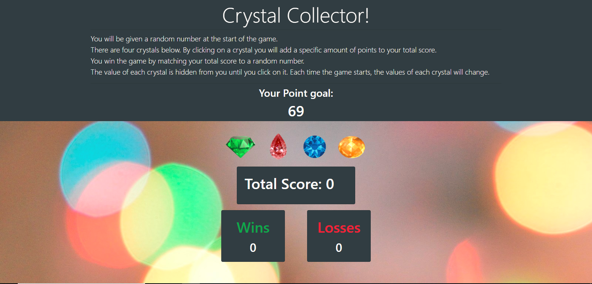

# Crystal-Collector
A Crystal Collecting game, where you must attempt to match your score with a goal number generated by the computer by selecting the right gems.

# Link to Deployed Site
[Crystal-Collector](https://aehaq.github.io/Crystal-Collector/)

# Preview


# Technology Used
- HTML
- CSS (Bootstrap)
- JavaScript
- jQuery

# Code Snippets
```
//Function used to assign hidden values to buttons
function randomizeButton(buttonid) {
    var randomVal = Math.floor(Math.random()*12) + 1;
    buttonid.attr("value", randomVal);
}

...

//Function used to initialize game. 
//Resets goal and randomize button using above functions, and prints all necessary current values. 
function initialize() {
    for (var i = 1; i < 5; i++) {
        randomizeButton($("#button-"+i));
    }
    setGoal();
    scoreCount = 0;
    $("#wins").text(winCount);
    $("#losses").text(lossCount);
    $("#score").text(scoreCount);
}

initialize();

```
- This snippet of code showcases my initialization function, which features a for loop which calls upon the randomize function showcased above it. By creating the first function and calling it in a for loop, I was able to simplify the process significantly. Moreover, by experimenting I found that you could actually use jquery to iterate through multiple unique html ids at once providing you follow a uniforn naming scheme for said ids.

# Learning Points
- Using jQuery to touch document to make changes more easily.
- Using javaScript to edit attributes within html tags to dynamically set and reset values.
- Assigning variables equal to elements called using jQuery inorder to invoke those elements in shorthand.
- Creating functions which invoke other functions.
- Determining whether a function needs to access a local and global variable so as to limit unnecessary global declarations.
- Using a for loop in conjunction with jquery to perform a single action multiple times on elements with unique IDs.
- Recognizing how the order of an if/else statement can result in a function being called early, and adjusting order as necessary to debug.

# Author 
Azfar Haq - [GitHub](https://github.com/aehaq)

# License
Standard MIT License